<!--  README_EN — Gustavo Casanova — @gcasiv — English Version -->

<!-- ══════════════════ FLAGS / LANGUAGE ══════════════════ -->
<div align="center">
  <a href="./README.md">
    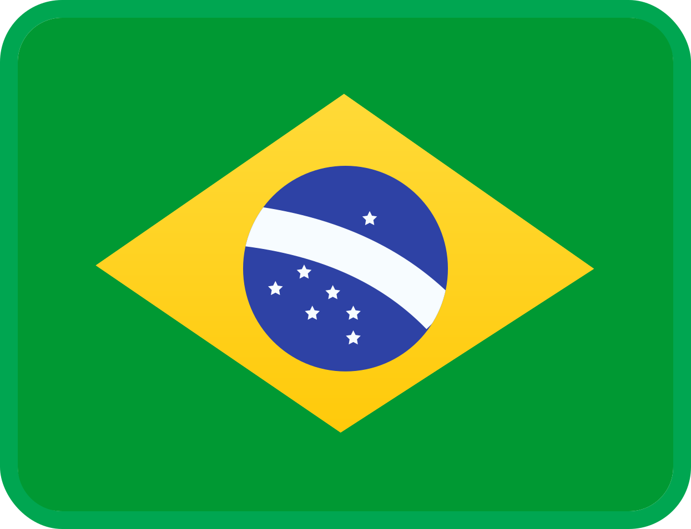
  </a>
  &nbsp;&nbsp;
  <a href="./README_EN.md">
    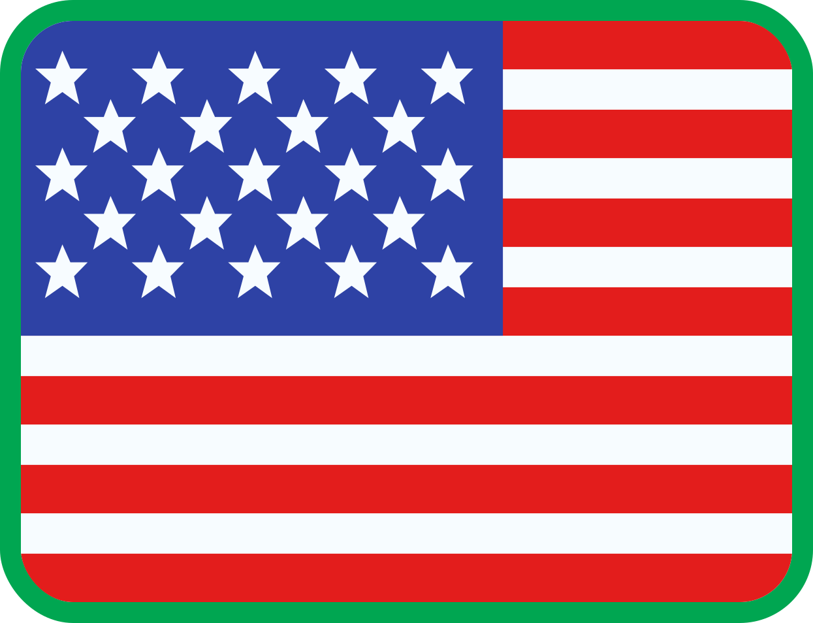
  </a>
</div>

<br/>

<!-- ══════════════════ BANNER ══════════════════ -->
<div align="center">
  
</div>

<!-- ══════════════════ TYPING ══════════════════ -->
<div align="center">
  
</div>

<br/>

---

<!-- ══════════════════ ABOUT ME ══════════════════ -->
<div align="center">
<table border="0" cellpadding="16" cellspacing="0">
<tr>
<td valign="top" width="58%">

### 🌿 Hey, I'm Gustavo!

```yaml
name:    "Gustavo Da Silva Casanova"
user:    "@gcasiv"
from:    "Rio de Janeiro, Brazil"
degree:  "Systems Analysis and Development"
sem:     "3rd semester (ongoing)"
goal:    "Full Stack Developer"
```

**About me:**

- Studying **ADS** and learning every day
- Passionate illustrator — I create **comics** and artwork
- Fan of **retro games** and classic videogames
- **Manga** reader — obsessed with **Hunter x Hunter**
- Always growing in **design**, **art** and **programming**
- Open to collaborations, partnerships and creative ideas
- Philosophy: *"Growing every single day."*

</td>
<td valign="top" width="42%" align="center">

<!-- CAT GIF — replace with your Aseprite gif when ready: -->
<!--  -->


<br/><br/>

<!-- VISITOR COUNTER -->


<br/>

<a href="https://github.com/gcasiv?tab=followers">
  
</a>

</td>
</tr>
</table>
</div>

---

<!-- ══════════════════ CONTACT ══════════════════ -->
<div align="center">

  <a href="https://www.behance.net/gcasiv" target="_blank">
    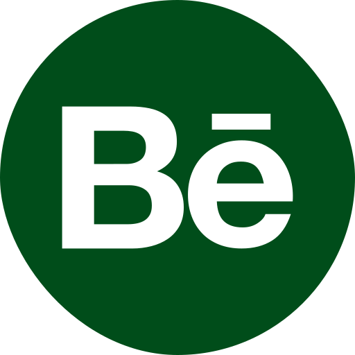
  </a>
  &nbsp;&nbsp;
  <a href="mailto:seuemail@gmail.com" target="_blank">
    
  </a>
  &nbsp;&nbsp;
  <a href="https://www.linkedin.com/in/gcasiv" target="_blank">
    
  </a>

</div>


<!-- ══════════════════ TECH STACK ══════════════════ -->
## Tech Stack

<div align="center">

<!-- ROW 1 -->
&nbsp;
&nbsp;
&nbsp;
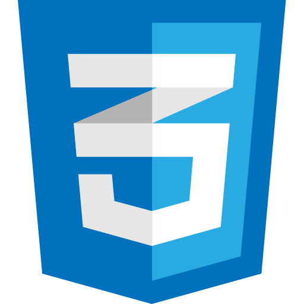&nbsp;
&nbsp;
&nbsp;
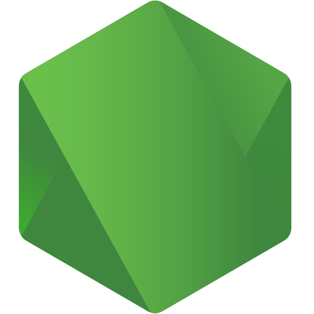&nbsp;
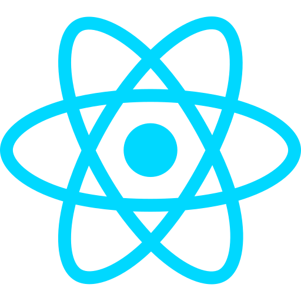&nbsp;
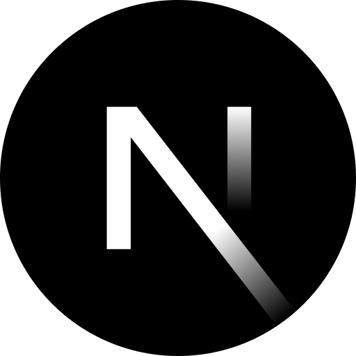&nbsp;
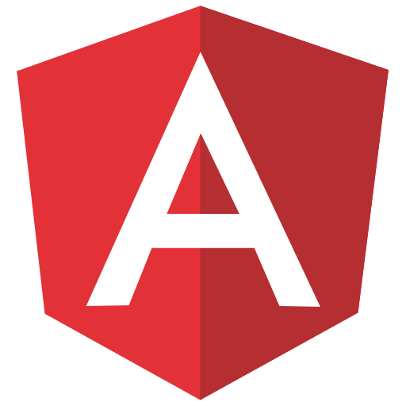


<!-- ROW 2 -->
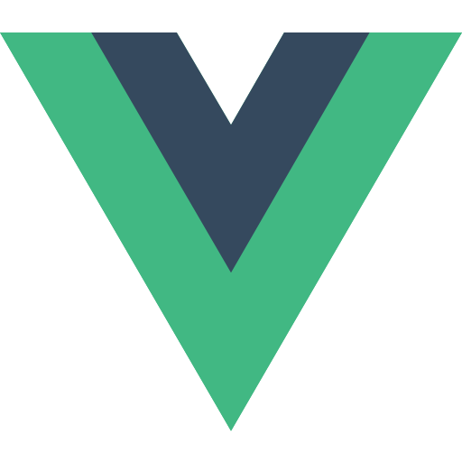&nbsp;
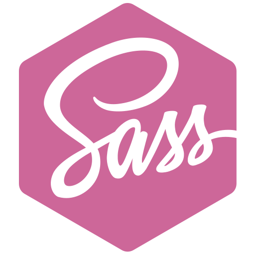&nbsp;
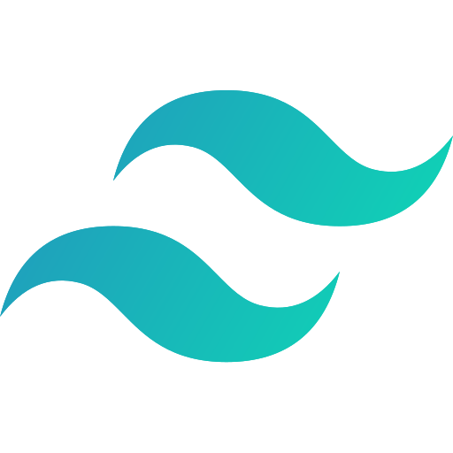&nbsp;
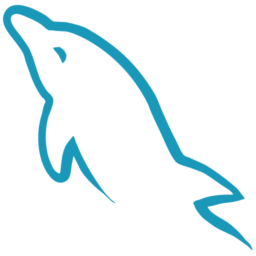&nbsp;
&nbsp;
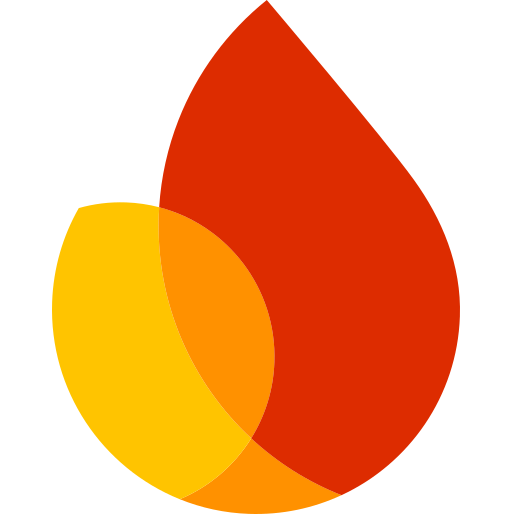&nbsp;
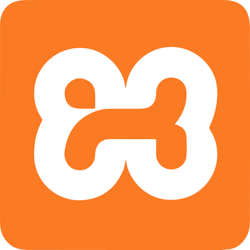&nbsp;
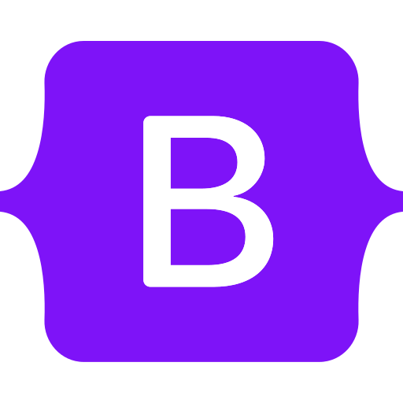&nbsp;
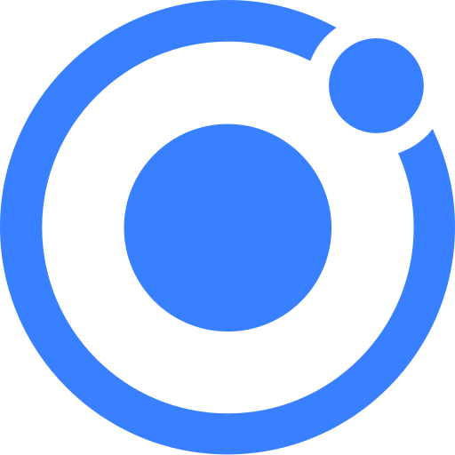&nbsp;
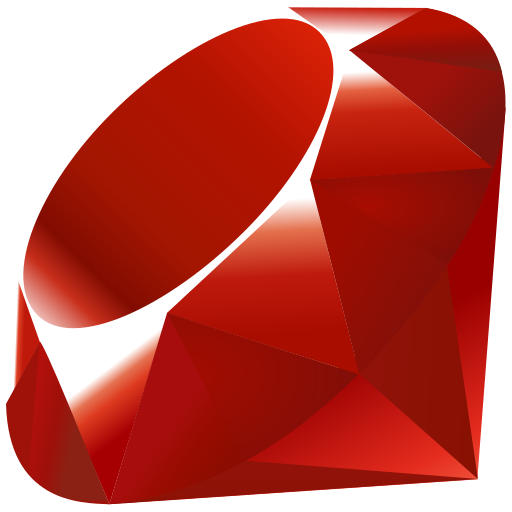


<!-- ROW 3 -->
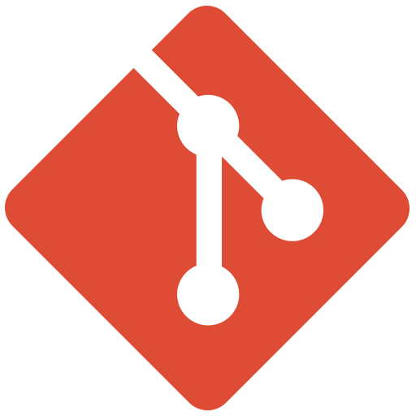&nbsp;
&nbsp;
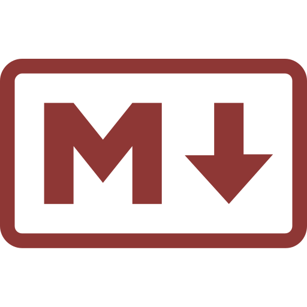&nbsp;
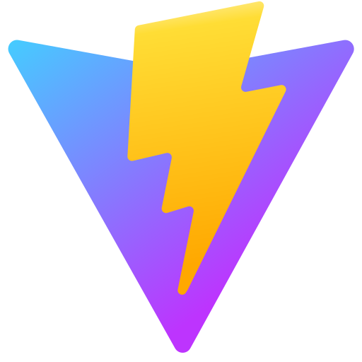&nbsp;
&nbsp;
&nbsp;
&nbsp;
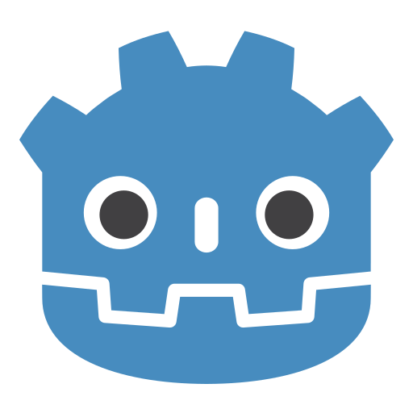&nbsp;
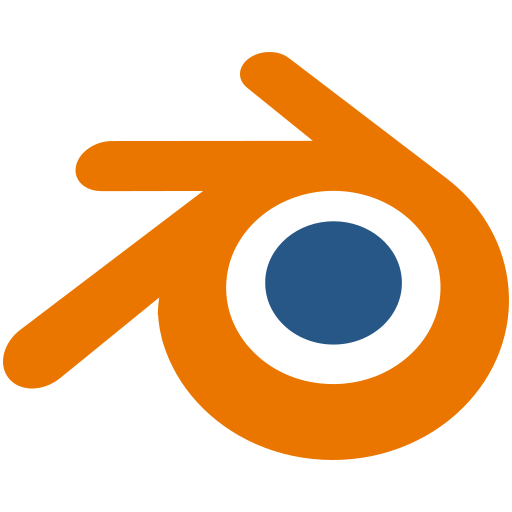&nbsp;
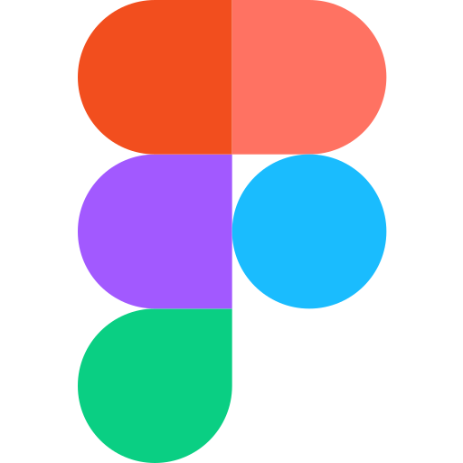


<!-- ROW 4 -->
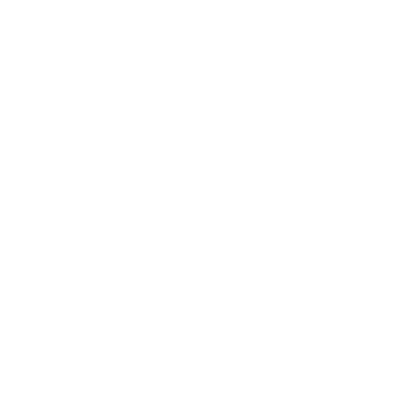&nbsp;
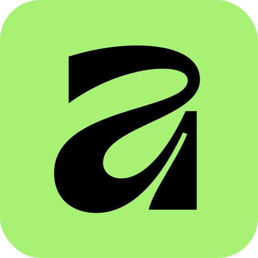&nbsp;
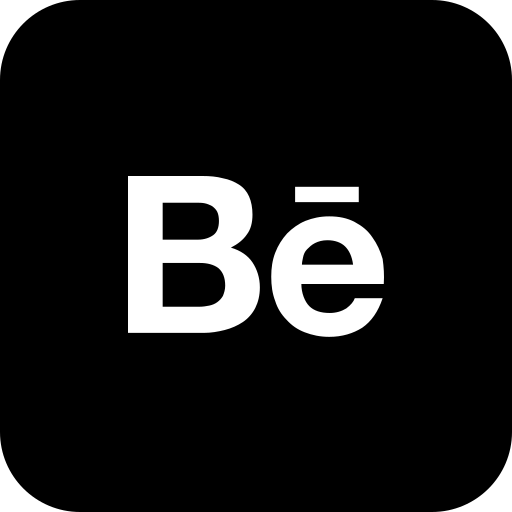&nbsp;
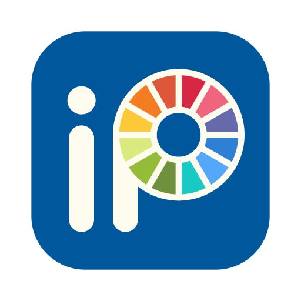&nbsp;
&nbsp;
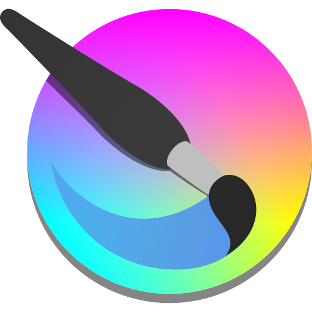&nbsp;
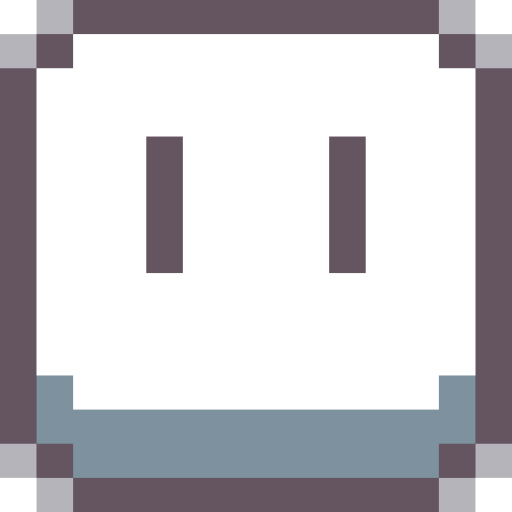&nbsp;
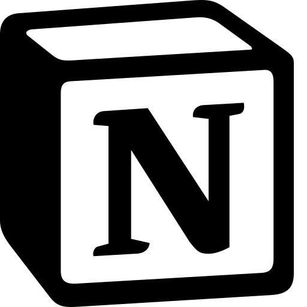&nbsp;
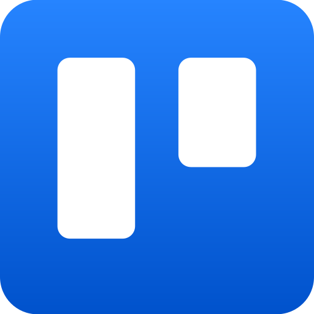

<br/>

<!-- SPECIAL LOGOS -->
&nbsp;&nbsp;
&nbsp;&nbsp;
&nbsp;&nbsp;
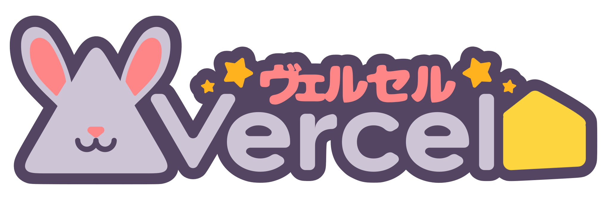

</div>

<br/>

<div align="center">
  
  &nbsp;
  
  &nbsp;
  
</div>

---

## GitHub Stats

<div align="center">


&nbsp;


</div>

<br/>

<div align="center">
  
</div>

<br/>

<div align="center">
  
</div>

---

## Activity

<div align="center">
  
</div>

---

<!-- ══════════════════ ART — SECOND TO LAST ══════════════════ -->
## Art & Illustration

<div align="center">

Beyond code, I live for art. Illustrations, comics and pixel art are my second language.

<br/>

<a href="https://www.instagram.com/colliriall" target="_blank">
  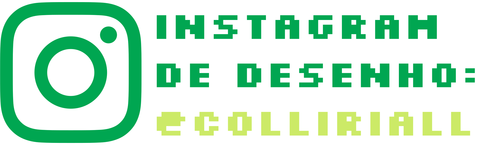
</a>
<br/>

</div>

---

<!-- ══════════════════ PAC-MAN — LAST ══════════════════ -->
## Contributions

<div align="center">

<picture>
  <source media="(prefers-color-scheme: dark)"
    srcset="https://raw.githubusercontent.com/gcasiv/gcasiv/output/pacman-contribution-graph-dark.svg"/>
  <source media="(prefers-color-scheme: light)"
    srcset="https://raw.githubusercontent.com/gcasiv/gcasiv/output/pacman-contribution-graph.svg"/>
  
</picture>

<br/>
<sub>To activate Pac-Man, follow the steps in <a href="./ESTRUTURA.md">ESTRUTURA.md</a></sub>

</div>

<!-- ══════════════════ FOOTER ══════════════════ -->
<br/>
<div align="center">
  
  <sub>Made with dedication by <strong>Gustavo Casanova</strong> · <a href="https://github.com/gcasiv">@gcasiv</a></sub>
  <br/>
  <sub><em>"Growing every single day."</em></sub>
</div>
